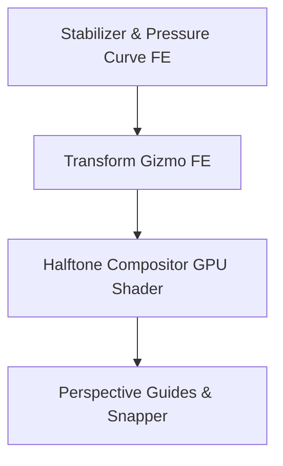

# Conductor Track: Professional Manga Drawing Features

**Track Key**: `sdd/professional-manga-features`
**Status**: `SPECIFICATION / ACTIVE`
**Date**: 2026-05-26
**Author**: Antigravity (Senior Graphic Architect)

---

## 1. Goal & Context
Transform `brick-draw` from a general tech-demo drawing application into a professional tool capable of meeting the demands of Japanese mangakas and digital illustrators. We aim to implement highly ergonomic features focused on precise inking, style replication, and layout control.

---

## 2. Feature Specifications

### A. Brush Stabilization (Streamline / Lazy Mouse)
*   **Purpose**: Prevent jagged, shaky strokes caused by micro-hand tremors, achieving razor-sharp lineart (inking).
*   **Technical Design**:
    *   Implement an interactive interpolation filter in the frontend inside the pointer event loop.
    *   **Algorithm**: *Exponential Moving Average (EMA)* or *Weighted Pull-String (Lazy Mouse)*. The rendering brush cursor lags slightly behind the physical cursor, connected by a virtual elastic string, averaging the path vectors.
    *   **Configuration**: Add a slider `Estabilización` (0 to 100%) in `BrushSettings`.

### B. Custom Pen Pressure Curves
*   **Purpose**: Calibrate how physical tablet pressure translates to logical opacity and stroke width.
*   **Technical Design**:
    *   Expose a cubic bezier coordinate panel in the UI.
    *   Multiply incoming raw tablet pressure `p` from `PointerEvent.pressure` through the bezier mapping function $f(p)$ before sending coordinates to `procesarTrazo`.
    *   Enable artists to customize preset curves: *Soft* (heavy response with low pressure), *Hard* (requires physical force for wider strokes), or *Linear*.

### C. Halftone Screentones (Tramas de Puntos)
*   **Purpose**: Replicate classic Japanese manga shading using structured dot patterns (halftones) instead of flat gray scales.
*   **Technical Design**:
    *   Create a specialized WebGL / Canvas2D fragment shader on the frontend composition layer.
    *   The shader analyzes the source canvas layer's gray intensity and maps it dynamically to a circular dot matrix grid (screentones).
    *   **Configurations**: Dot size, frequency (lines per inch / LPI), and angle (typically 45°).

### D. Interactive Selection Transformations (Gizmo)
*   **Purpose**: Scale, rotate, skew, or distort (warp) selected regions dynamically to adjust anatomy or layouts without redrawing.
*   **Technical Design**:
    *   Build a **Transform Gizmo** (bounding box with drag-handles) in React/TypeScript.
    *   When active, render the selected region inside a temporary Canvas layer.
    *   Implement *affine matrix transformations* (translation, rotation, scale) and *perspective transformations* (distortion) using 2D context homography.
    *   Commit the final rasterized pixels to the native Rust layer upon confirmation (using `cargarPngEnCapa`).

### E. Perspective Rulers (Reglas de Perspectiva)
*   **Purpose**: Enable drawing mathematically correct backgrounds, buildings, and speeds with automatic snapping.
*   **Technical Design**:
    *   Implement perspective guides for 1-point, 2-point, and 3-point perspective.
    *   Provide interactive vanishing points ($V_x, V_y, V_z$) on screen.
    *   When the brush draws, calculate the nearest angle toward the active vanishing point or vertical/horizontal axis, and **snap** the brush coordinates mathematically to that vector.

---

## 3. Implementation Workflow Plan

### Phase 1: Brush Stabilization & Pressure (Ergonomics)
1.  Extend `BrushSettings` struct in TypeScript.
2.  Implement the EMA stabilization algorithm in `src/hooks/engine/useDrawingEngine.ts` or a new hook `useStrokeStabilizer.ts`.
3.  Add pressure curve mapping.

### Phase 2: Selection Transform (Control)
1.  Implement a bounding box controller (Gizmo) on top of the selection mask.
2.  Apply coordinate mapping to deform the offscreen canvas region.
3.  Commit pixel changes through the hexagonal adapter `tauriService.ts`.

### Phase 3: Screentones (Styling)
1.  Write a WebGL compositor shader to convert grays into halftones.
2.  Add a "Trama Manga" toggle to the Layer Panel options.
